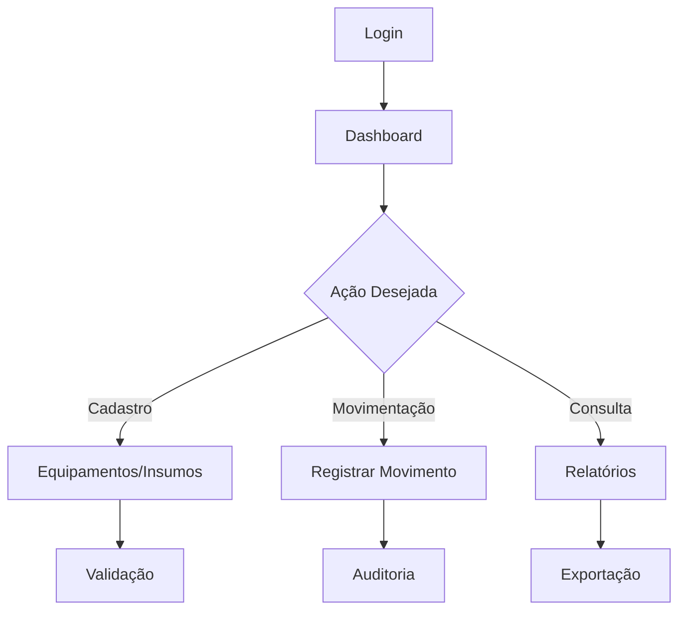
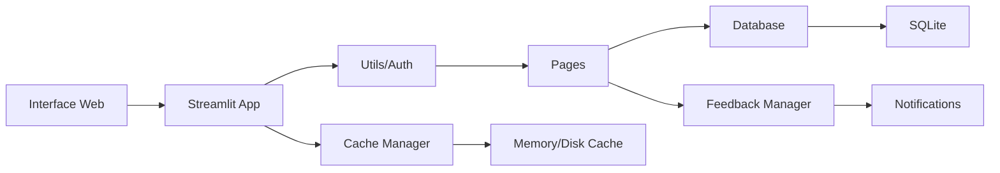

# 🏗️ Sistema de Inventário Web

[](https://python.org)
[](https://streamlit.io)
[](https://sqlite.org)
[](LICENSE)

Sistema web completo para gestão de inventário de equipamentos elétricos, manuais, insumos e movimentações. Desenvolvido com Streamlit para interface web moderna e responsiva.

## 📋 Índice

- [Características](#-características)
- [Capturas de Tela](#-capturas-de-tela)
- [Instalação](#-instalação)
- [Configuração](#-configuração)
- [Uso](#-uso)
- [Arquitetura](#-arquitetura)
- [API](#-api)
- [Contribuição](#-contribuição)
- [Licença](#-licença)
- [Suporte](#-suporte)

## ✨ Características

### 🔧 Funcionalidades Principais

- **📦 Gestão Completa de Inventário**
  - Equipamentos elétricos e manuais
  - Insumos e materiais
  - Obras/departamentos
  - Movimentações com histórico

- **👥 Sistema de Usuários**
  - Autenticação segura (bcrypt + SHA256)
  - Controle de permissões por roles
  - Sessões com timeout configurável
  - Proteção contra força bruta

- **🚨 Sistema de Alertas**
  - Movimentações pendentes
  - Itens com baixo estoque
  - Equipamentos sem movimentação
  - Notificações em tempo real

- **📊 Relatórios Avançados**
  - Dashboard interativo com métricas
  - Gráficos dinâmicos (Plotly)
  - Exportação em Excel, CSV, JSON
  - Filtros avançados por data/categoria

### 🎨 Interface e UX

- **🌈 Temas Personalizáveis**
  - Tema padrão, escuro, profissional, moderno
  - Alto contraste para acessibilidade
  - Alternância automática dia/noite
  - Configurações persistentes

- **⚡ Performance Otimizada**
  - Cache inteligente multi-camadas
  - Lazy loading de componentes
  - Compressão de dados
  - Índices otimizados no banco

- **📱 Design Responsivo**
  - Interface adaptativa
  - Componentes modernos
  - Animações suaves
  - Feedback visual avançado

### 🔒 Segurança

- **🛡️ Proteção Avançada**
  - Rate limiting por IP
  - Validação de entrada rigorosa
  - Auditoria completa de ações
  - Backup automático criptografado

## 📸 Capturas de Tela

### Dashboard Principal

*Visão geral com métricas e gráficos em tempo real*

### Gestão de Equipamentos

*Interface CRUD completa com validações*

### Relatórios Avançados

*Relatórios interativos com múltiplos formatos de exportação*

### Temas Personalizáveis

*Sistema de temas com configurações de acessibilidade*

## 🚀 Instalação

### Pré-requisitos

- Python 3.9 ou superior
- Git (opcional)
- 2GB de RAM mínimo
- 500MB de espaço em disco

### Instalação Automática (Recomendada)

```bash
# 1. Clone o repositório
git clone https://github.com/rangelharry/Inv_Web.git
cd Inv_Web

# 2. Execute o instalador automático
# Windows
.\instalar_web.bat

# Linux/Mac
chmod +x install.sh
./install.sh
```

### Instalação Manual

```bash
# 1. Clone o repositório
git clone https://github.com/rangelharry/Inv_Web.git
cd Inv_Web

# 2. Crie o ambiente virtual
python -m venv venv_web

# 3. Ative o ambiente virtual
# Windows
venv_web\Scripts\activate
# Linux/Mac
source venv_web/bin/activate

# 4. Instale as dependências
pip install -r requirements.txt

# 5. Configure o banco de dados
python setup_database.py
```

## ⚙️ Configuração

### Configuração Inicial

1. **Primeiro Acesso**
   ```bash
   # Execute a aplicação
   streamlit run app.py
   ```

2. **Usuário Administrador**
   - Usuário: `admin`
   - Senha: `admin123`
   - **⚠️ Altere a senha no primeiro acesso!**

3. **Configurações do Sistema**
   - Acesse `Configurações > Sistema`
   - Configure timeout de sessão
   - Defina preferências de tema
   - Configure backup automático

### Variáveis de Ambiente

Crie um arquivo `.env` na raiz do projeto:

```env
# Configurações do Banco
DATABASE_PATH=database/inventario.db
BACKUP_DIR=backups

# Configurações de Segurança
SESSION_TIMEOUT=1800
RATE_LIMIT_REQUESTS=100
RATE_LIMIT_WINDOW=3600

# Configurações da Aplicação
DEBUG=False
LOG_LEVEL=INFO
CACHE_ENABLED=True
```

### Configuração de Produção

```bash
# 1. Configure variáveis de ambiente
export STREAMLIT_SERVER_PORT=8501
export STREAMLIT_SERVER_ADDRESS=0.0.0.0
export STREAMLIT_SERVER_HEADLESS=true

# 2. Execute em modo produção
streamlit run app.py --server.port 8501 --server.headless true
```

## 📖 Uso

### Início Rápido

1. **Login no Sistema**
   - Acesse `http://localhost:8501`
   - Use as credenciais de administrador
   - Configure sua conta no primeiro acesso

2. **Cadastrar Primeira Obra**
   - Vá para `Obras/Departamentos`
   - Clique em "Nova Obra"
   - Preencha os dados obrigatórios

3. **Adicionar Equipamentos**
   - Acesse `Equipamentos Elétricos` ou `Equipamentos Manuais`
   - Use o formulário de cadastro
   - Vincule à obra criada

4. **Registrar Movimentações**
   - Vá para `Movimentações`
   - Selecione o equipamento
   - Registre entrada/saída/manutenção

### Fluxo de Trabalho Típico



### Casos de Uso Comuns

#### 1. Cadastro de Equipamento Elétrico
```python
# Dados necessários
{
    "codigo": "EQ001",
    "descricao": "Furadeira Bosch",
    "marca": "Bosch",
    "modelo": "GSB 120",
    "voltagem": "220V",
    "potencia": "650W",
    "obra_id": 1,
    "status": "Disponível"
}
```

#### 2. Movimentação de Equipment
```python
# Registro de movimentação
{
    "item_id": "EQ001",
    "tipo_item": "equipamento_eletrico",
    "tipo_movimentacao": "saida",
    "obra_origem_id": 1,
    "obra_destino_id": 2,
    "observacoes": "Transferência para obra X"
}
```

## 🏗️ Arquitetura

### Estrutura do Projeto

```
Inv_Web/
├── 📁 app.py                 # Aplicação principal
├── 📁 requirements.txt       # Dependências Python
├── 📁 README.md             # Este arquivo
├── 📁 database/             # Módulos do banco de dados
│   ├── connection.py        # Conexão e queries
│   └── integrity_manager.py # Validações e integridade
├── 📁 pages/                # Páginas da aplicação
│   ├── dashboard.py         # Dashboard principal
│   ├── equipamentos_eletricos.py
│   ├── equipamentos_manuais.py
│   ├── insumos.py
│   ├── obras.py
│   ├── movimentacoes.py
│   ├── relatorios.py
│   ├── configuracoes.py
│   └── alertas.py
├── 📁 utils/                # Utilitários
│   ├── auth.py              # Autenticação
│   ├── backup.py            # Sistema de backup
│   ├── themes.py            # Temas personalizáveis
│   ├── feedback.py          # Sistema de feedback
│   ├── performance.py       # Otimizações
│   └── lazy_loading.py      # Carregamento lazy
├── 📁 static/               # Arquivos estáticos
├── 📁 docs/                 # Documentação
├── 📁 backups/              # Backups automáticos
└── 📁 cache/                # Cache do sistema
```

### Componentes Principais

#### 1. **Sistema de Autenticação** (`utils/auth.py`)
- Gerenciamento de usuários e sessões
- Controle de permissões granular
- Rate limiting e proteção contra ataques

#### 2. **Gerenciador de Performance** (`utils/performance.py`)
- Cache multi-camadas (memória, sessão, disco)
- Otimização de queries SQL
- Monitoramento de performance

#### 3. **Sistema de Temas** (`utils/themes.py`)
- Temas personalizáveis
- Configurações de acessibilidade
- CSS dinâmico

#### 4. **Lazy Loading** (`utils/lazy_loading.py`)
- Carregamento sob demanda
- Paginação inteligente
- Otimização de componentes pesados

### Fluxo de Dados



### Banco de Dados

#### Schema Principal

```sql
-- Usuários e Autenticação
CREATE TABLE usuarios (
    id INTEGER PRIMARY KEY AUTOINCREMENT,
    usuario VARCHAR(50) UNIQUE NOT NULL,
    nome VARCHAR(100) NOT NULL,
    senha VARCHAR(255) NOT NULL,
    ultimo_acesso DATETIME
);

-- Obras/Departamentos
CREATE TABLE obras (
    id INTEGER PRIMARY KEY AUTOINCREMENT,
    nome VARCHAR(100) NOT NULL,
    descricao TEXT,
    responsavel VARCHAR(100),
    status VARCHAR(20) DEFAULT 'Ativo'
);

-- Equipamentos Elétricos
CREATE TABLE equipamentos_eletricos (
    id INTEGER PRIMARY KEY AUTOINCREMENT,
    codigo VARCHAR(50) UNIQUE NOT NULL,
    descricao VARCHAR(200) NOT NULL,
    marca VARCHAR(100),
    modelo VARCHAR(100),
    voltagem VARCHAR(20),
    potencia VARCHAR(50),
    obra_id INTEGER,
    status VARCHAR(20) DEFAULT 'Disponível',
    data_cadastro DATETIME DEFAULT CURRENT_TIMESTAMP,
    FOREIGN KEY (obra_id) REFERENCES obras(id)
);

-- Equipamentos Manuais
CREATE TABLE equipamentos_manuais (
    id INTEGER PRIMARY KEY AUTOINCREMENT,
    codigo VARCHAR(50) UNIQUE NOT NULL,
    descricao VARCHAR(200) NOT NULL,
    marca VARCHAR(100),
    categoria VARCHAR(100),
    obra_id INTEGER,
    status VARCHAR(20) DEFAULT 'Disponível',
    data_cadastro DATETIME DEFAULT CURRENT_TIMESTAMP,
    FOREIGN KEY (obra_id) REFERENCES obras(id)
);

-- Movimentações
CREATE TABLE movimentacoes (
    id INTEGER PRIMARY KEY AUTOINCREMENT,
    item_id VARCHAR(50) NOT NULL,
    tipo_item VARCHAR(30) NOT NULL,
    tipo_movimentacao VARCHAR(20) NOT NULL,
    obra_origem_id INTEGER,
    obra_destino_id INTEGER,
    data_movimentacao DATETIME DEFAULT CURRENT_TIMESTAMP,
    observacoes TEXT,
    usuario_id INTEGER,
    FOREIGN KEY (obra_origem_id) REFERENCES obras(id),
    FOREIGN KEY (obra_destino_id) REFERENCES obras(id),
    FOREIGN KEY (usuario_id) REFERENCES usuarios(id)
);

-- Auditoria
CREATE TABLE auditoria (
    id INTEGER PRIMARY KEY AUTOINCREMENT,
    usuario_id INTEGER,
    acao VARCHAR(100) NOT NULL,
    tabela VARCHAR(50),
    registro_id INTEGER,
    detalhes TEXT,
    data_hora DATETIME DEFAULT CURRENT_TIMESTAMP,
    FOREIGN KEY (usuario_id) REFERENCES usuarios(id)
);
```

#### Índices de Performance

```sql
-- Índices para otimização
CREATE INDEX idx_equipamentos_eletricos_status ON equipamentos_eletricos(status);
CREATE INDEX idx_equipamentos_eletricos_obra ON equipamentos_eletricos(obra_id);
CREATE INDEX idx_equipamentos_manuais_status ON equipamentos_manuais(status);
CREATE INDEX idx_movimentacoes_data ON movimentacoes(data_movimentacao);
CREATE INDEX idx_auditoria_usuario ON auditoria(usuario_id);
```

## 🔧 API

### Endpoints Principais

O sistema não expõe uma API REST tradicional, mas utiliza o padrão de módulos Python para interação:

#### Database Connection
```python
from database.connection import get_database

# Obter conexão com o banco
db = get_database()

# Executar query de seleção
result = db.execute_query("SELECT * FROM equipamentos_eletricos")

# Executar query de modificação
success = db.execute_update("INSERT INTO obras (nome) VALUES (?)", ("Nova Obra",))
```

#### Sistema de Cache
```python
from utils.performance import cache_data, get_cache_manager

# Usar decorator de cache
@cache_data(max_age=300, persist=True)
def get_expensive_data():
    return expensive_operation()

# Gerenciar cache manualmente
cache_manager = get_cache_manager()
cache_manager.set_cache("key", data, persist_to_disk=True)
cached_data = cache_manager.get_from_cache("key", max_age=300)
```

#### Sistema de Temas
```python
from utils.themes import get_theme_manager

theme_manager = get_theme_manager()
theme_manager.set_theme("dark")
current_theme = theme_manager.get_current_theme()
```

### Extensibilidade

O sistema foi projetado para ser facilmente extensível:

#### Adicionar Nova Página
```python
# pages/nova_funcionalidade.py
import streamlit as st
from utils.auth import get_auth

def show():
    auth = get_auth()
    auth.require_auth()
    
    st.markdown("## Nova Funcionalidade")
    # Implementar funcionalidade

if __name__ == "__main__":
    show()
```

#### Adicionar Novo Tema
```python
# Em utils/themes.py
def _get_custom_theme(self):
    return {
        "name": "Meu Tema",
        "primary_color": "#custom_color",
        # ... outras configurações
    }

# Registrar o tema
self.themes["custom"] = self._get_custom_theme()
```

## 🤝 Contribuição

### Como Contribuir

1. **Fork o repositório**
2. **Crie uma branch para sua feature**
   ```bash
   git checkout -b feature/nova-funcionalidade
   ```
3. **Commit suas mudanças**
   ```bash
   git commit -m "Adiciona nova funcionalidade X"
   ```
4. **Push para a branch**
   ```bash
   git push origin feature/nova-funcionalidade
   ```
5. **Abra um Pull Request**

### Padrões de Código

- **Python**: PEP 8
- **Docstrings**: Google Style
- **Type Hints**: Obrigatório para funções públicas
- **Testes**: Pytest para novas funcionalidades

### Estrutura de Commit

```
tipo(escopo): descrição curta

Descrição mais detalhada do que foi alterado.

- Lista de mudanças
- Outra mudança

Closes #123
```

Tipos: `feat`, `fix`, `docs`, `style`, `refactor`, `test`, `chore`

## 📄 Licença

Este projeto está licenciado sob a Licença MIT - veja o arquivo [LICENSE](LICENSE) para detalhes.

```
MIT License

Copyright (c) 2025 Sistema de Inventário Web

Permission is hereby granted, free of charge, to any person obtaining a copy
of this software and associated documentation files (the "Software"), to deal
in the Software without restriction, including without limitation the rights
to use, copy, modify, merge, publish, distribute, sublicense, and/or sell
copies of the Software, and to permit persons to whom the Software is
furnished to do so, subject to the following conditions:

The above copyright notice and this permission notice shall be included in all
copies or substantial portions of the Software.

THE SOFTWARE IS PROVIDED "AS IS", WITHOUT WARRANTY OF ANY KIND, EXPRESS OR
IMPLIED, INCLUDING BUT NOT LIMITED TO THE WARRANTIES OF MERCHANTABILITY,
FITNESS FOR A PARTICULAR PURPOSE AND NONINFRINGEMENT.
```

## 🆘 Suporte

### Documentação Adicional

- 📖 [Manual do Usuário](docs/user-manual.md)
- 🔧 [Guia de Instalação](docs/installation.md)
- 🏗️ [Documentação Técnica](docs/technical-docs.md)
- 🎨 [Guia de Temas](docs/themes.md)

### Canais de Suporte

- **Issues**: [GitHub Issues](https://github.com/rangelharry/Inv_Web/issues)
- **Discussões**: [GitHub Discussions](https://github.com/rangelharry/Inv_Web/discussions)
- **Email**: suporte@inventario-web.com
- **Wiki**: [Documentação Completa](https://github.com/rangelharry/Inv_Web/wiki)

### FAQ

#### Problemas Comuns

**P: O sistema não inicia após a instalação**
```bash
# R: Verifique se o ambiente virtual está ativo
source venv_web/bin/activate  # Linux/Mac
venv_web\Scripts\activate     # Windows

# Reinstale as dependências
pip install -r requirements.txt --upgrade
```

**P: Erro de permissão no banco de dados**
```bash
# R: Verifique as permissões do arquivo
chmod 666 database/inventario.db
chmod 755 database/
```

**P: Interface lenta ou travando**
```bash
# R: Limpe o cache do sistema
# Vá para Configurações > Aparência > Limpar Cache
# Ou reinicie a aplicação
```

### Performance e Monitoramento

- **CPU**: < 50% em operação normal
- **RAM**: < 200MB para até 1000 registros
- **Disco**: Backup automático com rotação
- **Rede**: Funciona offline, dados locais

### Roadmap

#### Versão 2.1 (Próxima)
- [ ] API REST completa
- [ ] Aplicativo móvel
- [ ] Integração com código de barras
- [ ] Relatórios PDF avançados

#### Versão 2.2 (Futura)
- [ ] Multi-tenancy
- [ ] Sincronização em nuvem
- [ ] Dashboard em tempo real
- [ ] Integração com ERP

---

<div align="center">
  <p><strong>Desenvolvido com ❤️ usando Python & Streamlit</strong></p>
  <p>
    <a href="#-características">Características</a> •
    <a href="#-instalação">Instalação</a> •
    <a href="#-uso">Uso</a> •
    <a href="#-contribuição">Contribuição</a> •
    <a href="#-suporte">Suporte</a>
  </p>
  
  
</div>