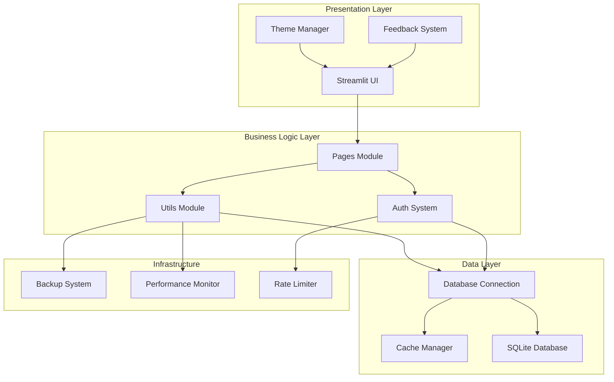

# 🔧 Documentação Técnica - Sistema de Inventário Web

## Índice

1. [Visão Geral da Arquitetura](#visão-geral-da-arquitetura)
2. [Estrutura do Código](#estrutura-do-código)
3. [Banco de Dados](#banco-de-dados)
4. [Sistema de Autenticação](#sistema-de-autenticação)
5. [Performance e Cache](#performance-e-cache)
6. [Sistema de Temas](#sistema-de-temas)
7. [APIs e Integrações](#apis-e-integrações)
8. [Deploy e Produção](#deploy-e-produção)
9. [Monitoramento](#monitoramento)
10. [Desenvolvimento](#desenvolvimento)

## Visão Geral da Arquitetura

### Stack Tecnológica

```
Frontend: Streamlit 1.28+
Backend: Python 3.9+
Database: SQLite 3.x
Cache: Multi-layer (Memory + Disk + Session)
Security: bcrypt + SHA256 + Rate Limiting
```

### Arquitetura de Componentes



### Fluxo de Requisição

```python
# 1. Requisição chega na aplicação Streamlit
app.py -> main()

# 2. Verificação de autenticação
utils/auth.py -> get_auth().is_authenticated()

# 3. Aplicação de tema
utils/themes.py -> get_theme_manager().apply_theme_css()

# 4. Carregamento de página
pages/{module}.py -> show()

# 5. Operações de banco (com cache)
database/connection.py -> get_database().execute_query()
utils/performance.py -> cache_manager.get_from_cache()

# 6. Renderização da resposta
Streamlit -> render components
```

## Estrutura do Código

### Organização de Módulos

```
├── app.py                    # 🚀 Aplicação principal
├── requirements.txt          # 📦 Dependências
│
├── database/                 # 🗄️ Camada de dados
│   ├── __init__.py
│   ├── connection.py         # Conexão SQLite
│   └── integrity_manager.py  # Validações e constraints
│
├── pages/                    # 📄 Módulos de interface
│   ├── __init__.py
│   ├── dashboard.py          # Dashboard principal
│   ├── equipamentos_eletricos.py
│   ├── equipamentos_manuais.py
│   ├── insumos.py
│   ├── obras.py
│   ├── movimentacoes.py
│   ├── relatorios.py
│   ├── configuracoes.py
│   └── alertas.py
│
├── utils/                    # 🛠️ Utilitários
│   ├── __init__.py
│   ├── auth.py               # Sistema de autenticação
│   ├── backup.py             # Backup automático
│   ├── themes.py             # Temas personalizáveis
│   ├── feedback.py           # Sistema de feedback
│   ├── performance.py        # Cache e performance
│   └── lazy_loading.py       # Carregamento lazy
│
├── static/                   # 📁 Arquivos estáticos
├── cache/                    # 💾 Cache do sistema
├── backups/                  # 💾 Backups automáticos
└── docs/                     # 📚 Documentação
```

### Padrões de Código

#### 1. Estrutura de Módulo de Página

```python
#!/usr/bin/env python3
# -*- coding: utf-8 -*-
"""
Docstring do módulo seguindo Google Style
"""

import streamlit as st
from typing import Dict, List, Optional, Any
from utils.auth import get_auth, check_authentication
from utils.performance import cache_data
from utils.feedback import get_feedback_manager

# Verificar autenticação quando acessado diretamente
if not check_authentication():
    st.stop()

@cache_data(max_age=300)
def get_data() -> List[Dict[str, Any]]:
    """
    Obter dados com cache otimizado
    
    Returns:
        List[Dict]: Lista de dados
    """
    # Implementação

def show_form():
    """Exibir formulário principal"""
    # Implementação

def show():
    """Função principal da página"""
    # Verificar autenticação
    auth = get_auth()
    auth.require_auth()
    
    # Header da página
    st.markdown("## 📄 Título da Página")
    
    # Conteúdo principal
    show_form()

if __name__ == "__main__":
    show()
```

#### 2. Padrão de Utilitário

```python
#!/usr/bin/env python3
# -*- coding: utf-8 -*-
"""
Docstring do utilitário
"""

from typing import Optional, Dict, Any
import threading

class UtilityManager:
    """Classe principal do utilitário"""
    
    def __init__(self):
        """Inicializar gerenciador"""
        self._lock = threading.Lock()
        self._initialize()
    
    def _initialize(self):
        """Inicialização privada"""
        pass
    
    def public_method(self, param: str) -> Optional[str]:
        """
        Método público
        
        Args:
            param: Parâmetro de entrada
        
        Returns:
            Optional[str]: Resultado ou None
        """
        with self._lock:
            # Implementação thread-safe
            pass

# Instância global (Singleton pattern)
_utility_manager = None

def get_utility_manager() -> UtilityManager:
    """
    Obter instância global do gerenciador
    
    Returns:
        UtilityManager: Instância do gerenciador
    """
    global _utility_manager
    if _utility_manager is None:
        _utility_manager = UtilityManager()
    return _utility_manager
```

### Convenções de Nomenclatura

```python
# Classes: PascalCase
class DatabaseManager:
    pass

# Funções e variáveis: snake_case
def get_user_data():
    user_name = "exemplo"

# Constantes: UPPER_SNAKE_CASE
SESSION_TIMEOUT = 1800
DEFAULT_CACHE_SIZE = 1000

# Arquivos e módulos: snake_case
# equipamentos_eletricos.py
# utils/performance.py
```

## Banco de Dados

### Schema Detalhado

#### Tabela `usuarios`

```sql
CREATE TABLE usuarios (
    id INTEGER PRIMARY KEY AUTOINCREMENT,
    usuario VARCHAR(50) UNIQUE NOT NULL,
    nome VARCHAR(100) NOT NULL,
    email VARCHAR(100) UNIQUE,
    senha VARCHAR(255) NOT NULL,           -- bcrypt hash
    salt VARCHAR(100),                     -- Salt para bcrypt
    role VARCHAR(20) DEFAULT 'user',       -- admin, user, readonly
    ativo BOOLEAN DEFAULT 1,
    ultimo_acesso DATETIME,
    tentativas_login INTEGER DEFAULT 0,
    bloqueado_ate DATETIME,
    created_at DATETIME DEFAULT CURRENT_TIMESTAMP,
    updated_at DATETIME DEFAULT CURRENT_TIMESTAMP
);
```

#### Índices de Performance

```sql
-- Usuários
CREATE INDEX idx_usuarios_usuario ON usuarios(usuario);
CREATE INDEX idx_usuarios_email ON usuarios(email);
CREATE INDEX idx_usuarios_ativo ON usuarios(ativo);

-- Equipamentos Elétricos
CREATE INDEX idx_equipamentos_eletricos_status ON equipamentos_eletricos(status);
CREATE INDEX idx_equipamentos_eletricos_obra ON equipamentos_eletricos(obra_id);
CREATE INDEX idx_equipamentos_eletricos_codigo ON equipamentos_eletricos(codigo);
CREATE INDEX idx_equipamentos_eletricos_data ON equipamentos_eletricos(data_cadastro);

-- Equipamentos Manuais
CREATE INDEX idx_equipamentos_manuais_status ON equipamentos_manuais(status);
CREATE INDEX idx_equipamentos_manuais_obra ON equipamentos_manuais(obra_id);
CREATE INDEX idx_equipamentos_manuais_codigo ON equipamentos_manuais(codigo);

-- Insumos
CREATE INDEX idx_insumos_status ON insumos(status);
CREATE INDEX idx_insumos_obra ON insumos(obra_id);
CREATE INDEX idx_insumos_codigo ON insumos(codigo);
CREATE INDEX idx_insumos_estoque ON insumos(quantidade_estoque);

-- Movimentações
CREATE INDEX idx_movimentacoes_data ON movimentacoes(data_movimentacao);
CREATE INDEX idx_movimentacoes_item ON movimentacoes(item_id, tipo_item);
CREATE INDEX idx_movimentacoes_usuario ON movimentacoes(usuario_id);
CREATE INDEX idx_movimentacoes_obra_origem ON movimentacoes(obra_origem_id);
CREATE INDEX idx_movimentacoes_obra_destino ON movimentacoes(obra_destino_id);

-- Auditoria
CREATE INDEX idx_auditoria_data ON auditoria(data_hora);
CREATE INDEX idx_auditoria_usuario ON auditoria(usuario_id);
CREATE INDEX idx_auditoria_tabela ON auditoria(tabela);
CREATE INDEX idx_auditoria_acao ON auditoria(acao);
```

#### Triggers de Auditoria

```sql
-- Trigger para equipamentos elétricos
CREATE TRIGGER trg_audit_equipamentos_eletricos_insert
AFTER INSERT ON equipamentos_eletricos
FOR EACH ROW
BEGIN
    INSERT INTO auditoria (
        usuario_id, acao, tabela, registro_id, 
        detalhes, data_hora
    ) VALUES (
        NEW.usuario_criacao_id, 'INSERT', 'equipamentos_eletricos', 
        NEW.id, 'Equipamento criado: ' || NEW.codigo, 
        CURRENT_TIMESTAMP
    );
END;

-- Triggers similares para UPDATE e DELETE...
```

### Gerenciamento de Conexão

```python
# database/connection.py

import sqlite3
import threading
from contextlib import contextmanager
from typing import List, Dict, Any, Optional

class DatabaseConnection:
    """Gerenciador de conexão SQLite thread-safe"""
    
    def __init__(self, db_path: str = "database/inventario.db"):
        self.db_path = db_path
        self._local = threading.local()
        self._lock = threading.Lock()
    
    @property
    def connection(self) -> sqlite3.Connection:
        """Obter conexão thread-local"""
        if not hasattr(self._local, 'connection'):
            self._local.connection = sqlite3.connect(
                self.db_path,
                check_same_thread=False,
                timeout=30.0
            )
            self._local.connection.row_factory = sqlite3.Row
            # Habilitar foreign keys
            self._local.connection.execute("PRAGMA foreign_keys = ON")
            
        return self._local.connection
    
    @contextmanager
    def transaction(self):
        """Context manager para transações"""
        conn = self.connection
        try:
            yield conn
            conn.commit()
        except Exception:
            conn.rollback()
            raise
    
    def execute_query(
        self, 
        query: str, 
        params: tuple = None
    ) -> List[Dict[str, Any]]:
        """
        Executar query de seleção
        
        Args:
            query: SQL query
            params: Parâmetros da query
        
        Returns:
            List[Dict]: Resultados da query
        """
        with self._lock:
            cursor = self.connection.cursor()
            
            if params:
                cursor.execute(query, params)
            else:
                cursor.execute(query)
            
            rows = cursor.fetchall()
            return [dict(row) for row in rows]
    
    def execute_update(
        self, 
        query: str, 
        params: tuple = None
    ) -> bool:
        """
        Executar query de modificação (INSERT, UPDATE, DELETE)
        
        Args:
            query: SQL query
            params: Parâmetros da query
        
        Returns:
            bool: Sucesso da operação
        """
        try:
            with self.transaction():
                cursor = self.connection.cursor()
                
                if params:
                    cursor.execute(query, params)
                else:
                    cursor.execute(query)
                
                return cursor.rowcount > 0
        
        except Exception as e:
            print(f"Erro na query: {e}")
            return False
```

## Sistema de Autenticação

### Arquitetura de Segurança

```python
# utils/auth.py

import bcrypt
import hashlib
import secrets
from datetime import datetime, timedelta
from typing import Optional, Dict, Any

class AuthenticationManager:
    """Gerenciador de autenticação robusto"""
    
    def __init__(self):
        self.session_timeout = 1800  # 30 minutos
        self.max_login_attempts = 5
        self.lockout_duration = 1800  # 30 minutos
        
    def hash_password(self, password: str) -> Dict[str, str]:
        """
        Criar hash seguro da senha
        
        Args:
            password: Senha em texto plano
        
        Returns:
            Dict: Hash e salt da senha
        """
        # Gerar salt único
        salt = bcrypt.gensalt(rounds=12)
        
        # Hash com bcrypt
        bcrypt_hash = bcrypt.hashpw(password.encode('utf-8'), salt)
        
        # Hash adicional com SHA256 + salt personalizado
        custom_salt = secrets.token_hex(32)
        sha256_hash = hashlib.sha256(
            (password + custom_salt).encode('utf-8')
        ).hexdigest()
        
        return {
            'bcrypt_hash': bcrypt_hash.decode('utf-8'),
            'sha256_hash': sha256_hash,
            'custom_salt': custom_salt
        }
    
    def verify_password(
        self, 
        password: str, 
        stored_hash: str, 
        stored_salt: str = None
    ) -> bool:
        """
        Verificar senha com múltiplas camadas
        
        Args:
            password: Senha fornecida
            stored_hash: Hash armazenado
            stored_salt: Salt armazenado (se houver)
        
        Returns:
            bool: Senha válida
        """
        try:
            # Verificação bcrypt
            if stored_hash.startswith('$2b$'):
                return bcrypt.checkpw(
                    password.encode('utf-8'), 
                    stored_hash.encode('utf-8')
                )
            
            # Verificação SHA256 + salt (compatibilidade)
            if stored_salt:
                computed_hash = hashlib.sha256(
                    (password + stored_salt).encode('utf-8')
                ).hexdigest()
                return computed_hash == stored_hash
            
            # Verificação SHA256 simples (legacy)
            computed_hash = hashlib.sha256(
                password.encode('utf-8')
            ).hexdigest()
            return computed_hash == stored_hash
            
        except Exception:
            return False
```

### Rate Limiting

```python
# utils/rate_limiting.py

import time
from collections import defaultdict, deque
from typing import Dict, Tuple
import threading

class RateLimiter:
    """Rate limiter para proteção contra ataques"""
    
    def __init__(
        self, 
        max_requests: int = 100, 
        window_seconds: int = 3600
    ):
        self.max_requests = max_requests
        self.window_seconds = window_seconds
        self.requests: Dict[str, deque] = defaultdict(deque)
        self.blocked_clients: Dict[str, float] = {}
        self._lock = threading.Lock()
    
    def is_allowed(self, client_id: str) -> Tuple[bool, int]:
        """
        Verificar se client pode fazer request
        
        Args:
            client_id: Identificador único do client
        
        Returns:
            Tuple[bool, int]: (permitido, requests_restantes)
        """
        with self._lock:
            current_time = time.time()
            
            # Verificar se client está bloqueado
            if client_id in self.blocked_clients:
                if current_time < self.blocked_clients[client_id]:
                    return False, 0
                else:
                    # Desbloquear client
                    del self.blocked_clients[client_id]
            
            # Limpar requests antigas
            client_requests = self.requests[client_id]
            cutoff_time = current_time - self.window_seconds
            
            while client_requests and client_requests[0] < cutoff_time:
                client_requests.popleft()
            
            # Verificar limite
            if len(client_requests) >= self.max_requests:
                # Bloquear client
                self.blocked_clients[client_id] = (
                    current_time + self.window_seconds
                )
                return False, 0
            
            # Registrar request
            client_requests.append(current_time)
            remaining = self.max_requests - len(client_requests)
            
            return True, remaining
```

## Performance e Cache

### Sistema de Cache Multi-Camadas

```python
# utils/performance.py

class CacheManager:
    """Cache inteligente com múltiplas camadas"""
    
    def __init__(self):
        # Camada 1: Cache em memória (mais rápido)
        self.memory_cache: Dict[str, Any] = {}
        
        # Camada 2: Cache da sessão Streamlit
        self._initialize_session_cache()
        
        # Camada 3: Cache em disco (persistente)
        self.disk_cache_dir = "cache"
        
        # Estatísticas
        self.stats = {
            'memory_hits': 0,
            'session_hits': 0,
            'disk_hits': 0,
            'misses': 0,
            'total_requests': 0
        }
    
    def get_from_cache(
        self, 
        key: str, 
        max_age: int = 300
    ) -> Optional[Any]:
        """
        Obter valor do cache (multi-camadas)
        
        Args:
            key: Chave do cache
            max_age: Idade máxima em segundos
        
        Returns:
            Valor do cache ou None
        """
        self.stats['total_requests'] += 1
        
        # Camada 1: Memória
        if key in self.memory_cache:
            entry = self.memory_cache[key]
            if self._is_fresh(entry, max_age):
                self.stats['memory_hits'] += 1
                return entry['data']
        
        # Camada 2: Sessão Streamlit
        session_key = f"cache_{key}"
        if session_key in st.session_state:
            entry = st.session_state[session_key]
            if self._is_fresh(entry, max_age):
                # Promover para cache de memória
                self.memory_cache[key] = entry
                self.stats['session_hits'] += 1
                return entry['data']
        
        # Camada 3: Disco
        disk_data = self._load_from_disk(key, max_age)
        if disk_data is not None:
            # Promover para camadas superiores
            entry = {
                'data': disk_data,
                'timestamp': datetime.now()
            }
            self.memory_cache[key] = entry
            st.session_state[session_key] = entry
            self.stats['disk_hits'] += 1
            return disk_data
        
        self.stats['misses'] += 1
        return None
```

### Otimizações de Query

```python
def optimize_database_queries():
    """Aplicar otimizações de performance no banco"""
    
    # 1. PRAGMA otimizations
    optimizations = [
        "PRAGMA journal_mode = WAL",        # Write-Ahead Logging
        "PRAGMA synchronous = NORMAL",      # Balanço segurança/performance
        "PRAGMA cache_size = 10000",        # Cache de 10MB
        "PRAGMA temp_store = MEMORY",       # Tabelas temp em memória
        "PRAGMA mmap_size = 268435456",     # Memory mapping 256MB
        "PRAGMA optimize"                   # Auto-otimização
    ]
    
    db = get_database()
    for pragma in optimizations:
        try:
            db.execute_update(pragma)
        except:
            pass  # Ignorar erros de compatibilidade
    
    # 2. Análise de estatísticas
    db.execute_update("ANALYZE")
```

### Lazy Loading Avançado

```python
# utils/lazy_loading.py

class LazyComponentLoader:
    """Carregamento lazy de componentes pesados"""
    
    def __init__(self):
        self.loaded_components = set()
        self.loading_queue = []
        
    def lazy_dataframe(
        self, 
        query_func: Callable,
        component_id: str,
        page_size: int = 50,
        virtual_scroll: bool = True
    ):
        """
        DataFrame com scroll virtual e paginação
        
        Args:
            query_func: Função que retorna dados
            component_id: ID único do componente
            page_size: Registros por página
            virtual_scroll: Ativar scroll virtual
        """
        # Obter total de registros (query count otimizada)
        total_count = self._get_total_count(query_func)
        
        if virtual_scroll and total_count > 1000:
            # Scroll virtual para grandes datasets
            self._render_virtual_scroll(
                query_func, component_id, total_count, page_size
            )
        else:
            # Paginação tradicional
            self._render_pagination(
                query_func, component_id, total_count, page_size
            )
    
    def _render_virtual_scroll(self, query_func, component_id, total, page_size):
        """Implementar scroll virtual para performance"""
        
        # Calcular viewport
        viewport_height = st.session_state.get(f"{component_id}_viewport", 400)
        row_height = 40  # altura estimada por linha
        visible_rows = int(viewport_height / row_height)
        
        # Scroll position
        scroll_top = st.session_state.get(f"{component_id}_scroll", 0)
        start_index = int(scroll_top / row_height)
        
        # Buffer para scroll suave
        buffer_size = visible_rows // 2
        actual_start = max(0, start_index - buffer_size)
        actual_end = min(total, start_index + visible_rows + buffer_size)
        
        # Carregar apenas dados visíveis
        visible_data = query_func(
            limit=actual_end - actual_start,
            offset=actual_start
        )
        
        # Renderizar com scroll personalizado
        self._render_virtual_table(visible_data, actual_start, total, component_id)
```

## Sistema de Temas

### Arquitetura de Temas

```python
# utils/themes.py

class ThemeManager:
    """Gerenciador avançado de temas"""
    
    def __init__(self):
        self.themes = self._load_themes()
        self.custom_css_cache = {}
        
    def apply_theme_css(self) -> str:
        """Gerar CSS otimizado para o tema atual"""
        
        theme = self.get_current_theme()
        cache_key = f"css_{theme['name']}_{hash(str(theme))}"
        
        # Verificar cache CSS
        if cache_key in self.custom_css_cache:
            return self.custom_css_cache[cache_key]
        
        # Gerar CSS dinamicamente
        css = self._generate_css(theme)
        
        # Minificar CSS
        minified_css = self._minify_css(css)
        
        # Cachear resultado
        self.custom_css_cache[cache_key] = minified_css
        
        return minified_css
    
    def _generate_css(self, theme: Dict[str, Any]) -> str:
        """Gerar CSS completo baseado no tema"""
        
        css_template = """
        <style>
            :root {
                --primary-color: {primary_color};
                --secondary-color: {secondary_color};
                --success-color: {success_color};
                --warning-color: {warning_color};
                --error-color: {error_color};
                --background-color: {background_color};
                --text-color: {text_color};
                --border-radius: {border_radius};
                --font-family: {font_family};
                --card-shadow: {card_shadow};
            }
            
            /* Componentes base */
            .stApp {{
                font-family: var(--font-family);
                background-color: var(--background-color);
                color: var(--text-color);
            }}
            
            /* Botões modernos */
            .stButton > button {{
                background: linear-gradient(135deg, var(--primary-color), var(--secondary-color));
                color: white;
                border: none;
                border-radius: var(--border-radius);
                padding: 0.6rem 1.2rem;
                font-weight: 600;
                transition: all 0.3s cubic-bezier(0.4, 0, 0.2, 1);
                box-shadow: var(--card-shadow);
                position: relative;
                overflow: hidden;
            }}
            
            .stButton > button::before {{
                content: '';
                position: absolute;
                top: 0;
                left: -100%;
                width: 100%;
                height: 100%;
                background: linear-gradient(90deg, transparent, rgba(255,255,255,0.2), transparent);
                transition: left 0.5s;
            }}
            
            .stButton > button:hover::before {{
                left: 100%;
            }}
            
            .stButton > button:hover {{
                transform: translateY(-2px);
                box-shadow: 0 8px 25px rgba(0,0,0,0.15);
            }}
            
            /* Cards com animações */
            .metric-card {{
                background: var(--background-color);
                border-radius: var(--border-radius);
                box-shadow: var(--card-shadow);
                border-left: 4px solid var(--primary-color);
                transition: all 0.3s ease;
                position: relative;
                overflow: hidden;
            }}
            
            .metric-card::after {{
                content: '';
                position: absolute;
                top: 0;
                right: -50px;
                width: 50px;
                height: 100%;
                background: linear-gradient(90deg, transparent, var(--primary-color)20);
                transform: skewX(-10deg);
                transition: right 0.3s ease;
            }}
            
            .metric-card:hover {{
                transform: translateY(-4px);
                box-shadow: 0 12px 40px rgba(0,0,0,0.1);
            }}
            
            .metric-card:hover::after {{
                right: 100%;
            }}
            
            /* Sidebar premium */
            .stSidebar {{
                background: linear-gradient(180deg, var(--background-color), {self._adjust_color(theme['background_color'], -10)});
                border-right: 1px solid var(--primary-color)30;
            }}
            
            /* Inputs modernos */
            .stTextInput > div > div > input,
            .stSelectbox > div > div > select {{
                border: 2px solid transparent;
                background: var(--background-color);
                border-radius: var(--border-radius);
                transition: all 0.3s ease;
                box-shadow: var(--card-shadow);
            }}
            
            .stTextInput > div > div > input:focus,
            .stSelectbox > div > div > select:focus {{
                border-color: var(--primary-color);
                box-shadow: 0 0 0 3px var(--primary-color)20;
                transform: scale(1.02);
            }}
            
            /* Animações globais */
            @keyframes fadeInUp {{
                from {{
                    opacity: 0;
                    transform: translateY(30px);
                }}
                to {{
                    opacity: 1;
                    transform: translateY(0);
                }}
            }}
            
            @keyframes slideInRight {{
                from {{
                    opacity: 0;
                    transform: translateX(50px);
                }}
                to {{
                    opacity: 1;
                    transform: translateX(0);
                }}
            }}
            
            .fade-in {{
                animation: fadeInUp 0.6s cubic-bezier(0.4, 0, 0.2, 1);
            }}
            
            .slide-in {{
                animation: slideInRight 0.5s cubic-bezier(0.4, 0, 0.2, 1);
            }}
        </style>
        """
        
        return css_template.format(**theme)
```

## Deploy e Produção

### Configuração Docker

```dockerfile
# Dockerfile
FROM python:3.11-slim

# Instalar dependências do sistema
RUN apt-get update && apt-get install -y \
    build-essential \
    curl \
    software-properties-common \
    git \
    && rm -rf /var/lib/apt/lists/*

# Criar usuário não-root
RUN useradd --create-home --shell /bin/bash streamlit
USER streamlit
WORKDIR /home/streamlit

# Copiar requirements e instalar dependências Python
COPY requirements.txt .
RUN pip install --user --no-cache-dir -r requirements.txt

# Copiar código da aplicação
COPY --chown=streamlit:streamlit . .

# Criar diretórios necessários
RUN mkdir -p database cache backups logs

# Expor porta
EXPOSE 8501

# Health check
HEALTHCHECK CMD curl --fail http://localhost:8501/_stcore/health

# Comando padrão
CMD ["python", "-m", "streamlit", "run", "app.py", "--server.port=8501", "--server.address=0.0.0.0"]
```

### Docker Compose para Produção

```yaml
# docker-compose.prod.yml
version: '3.8'

services:
  inventario-web:
    build: .
    container_name: inventario-web-prod
    restart: unless-stopped
    ports:
      - "8501:8501"
    environment:
      - STREAMLIT_SERVER_HEADLESS=true
      - STREAMLIT_SERVER_PORT=8501
      - STREAMLIT_SERVER_ADDRESS=0.0.0.0
      - PYTHONPATH=/home/streamlit
    volumes:
      - ./database:/home/streamlit/database:Z
      - ./backups:/home/streamlit/backups:Z
      - ./logs:/home/streamlit/logs:Z
      - ./cache:/home/streamlit/cache:Z
    networks:
      - inventario-network
    
  nginx:
    image: nginx:alpine
    container_name: inventario-nginx
    restart: unless-stopped
    ports:
      - "80:80"
      - "443:443"
    volumes:
      - ./nginx.conf:/etc/nginx/nginx.conf:ro
      - ./ssl:/etc/nginx/ssl:ro
    depends_on:
      - inventario-web
    networks:
      - inventario-network

networks:
  inventario-network:
    driver: bridge
```

### Configuração Nginx

```nginx
# nginx.conf
events {
    worker_connections 1024;
}

http {
    upstream streamlit {
        server inventario-web:8501;
    }
    
    # Rate limiting
    limit_req_zone $binary_remote_addr zone=api:10m rate=10r/s;
    
    server {
        listen 80;
        server_name inventario.empresa.com;
        return 301 https://$server_name$request_uri;
    }
    
    server {
        listen 443 ssl http2;
        server_name inventario.empresa.com;
        
        # SSL Configuration
        ssl_certificate /etc/nginx/ssl/cert.pem;
        ssl_certificate_key /etc/nginx/ssl/key.pem;
        ssl_protocols TLSv1.2 TLSv1.3;
        ssl_ciphers ECDHE-RSA-AES256-GCM-SHA512:DHE-RSA-AES256-GCM-SHA512;
        
        # Security headers
        add_header X-Frame-Options DENY;
        add_header X-Content-Type-Options nosniff;
        add_header X-XSS-Protection "1; mode=block";
        add_header Strict-Transport-Security "max-age=31536000; includeSubDomains";
        
        # Gzip compression
        gzip on;
        gzip_comp_level 6;
        gzip_types text/plain text/css application/javascript application/json;
        
        location / {
            # Rate limiting
            limit_req zone=api burst=20 nodelay;
            
            proxy_pass http://streamlit;
            proxy_http_version 1.1;
            proxy_set_header Upgrade $http_upgrade;
            proxy_set_header Connection "upgrade";
            proxy_set_header Host $host;
            proxy_set_header X-Real-IP $remote_addr;
            proxy_set_header X-Forwarded-For $proxy_add_x_forwarded_for;
            proxy_set_header X-Forwarded-Proto $scheme;
            
            # Timeouts
            proxy_connect_timeout 60s;
            proxy_send_timeout 60s;
            proxy_read_timeout 60s;
        }
    }
}
```

## Monitoramento

### Sistema de Logs

```python
# utils/logging_manager.py

import logging
import logging.handlers
from datetime import datetime
from typing import Dict, Any
import json
import threading

class AdvancedLogger:
    """Sistema de logs estruturado"""
    
    def __init__(self, name: str = "inventario_web"):
        self.logger = logging.getLogger(name)
        self.logger.setLevel(logging.INFO)
        
        # Evitar handlers duplicados
        if not self.logger.handlers:
            self._setup_handlers()
    
    def _setup_handlers(self):
        """Configurar handlers de log"""
        
        # Handler para arquivo (rotativo)
        file_handler = logging.handlers.RotatingFileHandler(
            'logs/sistema.log',
            maxBytes=10*1024*1024,  # 10MB
            backupCount=5,
            encoding='utf-8'
        )
        
        # Handler para console
        console_handler = logging.StreamHandler()
        
        # Formatter estruturado
        formatter = logging.Formatter(
            '%(asctime)s - %(name)s - %(levelname)s - %(message)s'
        )
        
        file_handler.setFormatter(formatter)
        console_handler.setFormatter(formatter)
        
        self.logger.addHandler(file_handler)
        self.logger.addHandler(console_handler)
    
    def log_user_action(
        self, 
        user_id: int, 
        action: str, 
        details: Dict[str, Any] = None
    ):
        """Log de ação do usuário"""
        log_entry = {
            'timestamp': datetime.now().isoformat(),
            'user_id': user_id,
            'action': action,
            'details': details or {},
            'session_id': st.session_state.get('session_id'),
            'ip_address': self._get_client_ip()
        }
        
        self.logger.info(f"USER_ACTION: {json.dumps(log_entry)}")
    
    def log_performance(
        self, 
        operation: str, 
        duration: float, 
        details: Dict[str, Any] = None
    ):
        """Log de performance"""
        log_entry = {
            'timestamp': datetime.now().isoformat(),
            'operation': operation,
            'duration_ms': duration * 1000,
            'details': details or {}
        }
        
        # Log como WARNING se operação demorou muito
        if duration > 5.0:
            self.logger.warning(f"SLOW_OPERATION: {json.dumps(log_entry)}")
        else:
            self.logger.info(f"PERFORMANCE: {json.dumps(log_entry)}")
```

### Métricas de Sistema

```python
# utils/metrics.py

import psutil
import time
from datetime import datetime, timedelta
from typing import Dict, List

class SystemMetrics:
    """Coleta de métricas do sistema"""
    
    def __init__(self):
        self.metrics_history: List[Dict] = []
        self.start_time = time.time()
    
    def collect_metrics(self) -> Dict[str, Any]:
        """Coletar métricas atuais do sistema"""
        
        # Métricas de sistema
        cpu_percent = psutil.cpu_percent(interval=1)
        memory = psutil.virtual_memory()
        disk = psutil.disk_usage('.')
        
        # Métricas da aplicação
        cache_manager = get_cache_manager()
        cache_stats = cache_manager.get_cache_stats()
        
        # Métricas do banco
        db_metrics = self._get_database_metrics()
        
        metrics = {
            'timestamp': datetime.now().isoformat(),
            'uptime_seconds': time.time() - self.start_time,
            'system': {
                'cpu_percent': cpu_percent,
                'memory_percent': memory.percent,
                'memory_used_mb': memory.used // (1024 * 1024),
                'disk_percent': disk.percent,
                'disk_free_gb': disk.free // (1024 * 1024 * 1024)
            },
            'cache': cache_stats,
            'database': db_metrics,
            'sessions': {
                'active_sessions': len(st.session_state) if 'st' in globals() else 0
            }
        }
        
        # Manter histórico das últimas 24h
        self.metrics_history.append(metrics)
        cutoff = datetime.now() - timedelta(hours=24)
        self.metrics_history = [
            m for m in self.metrics_history 
            if datetime.fromisoformat(m['timestamp']) > cutoff
        ]
        
        return metrics
    
    def _get_database_metrics(self) -> Dict[str, Any]:
        """Métricas específicas do banco de dados"""
        try:
            db = get_database()
            
            # Tamanho do arquivo de banco
            db_size = os.path.getsize('database/inventario.db')
            
            # Contagem de registros principais
            counts = {}
            tables = ['usuarios', 'equipamentos_eletricos', 'equipamentos_manuais', 
                     'insumos', 'obras', 'movimentacoes', 'auditoria']
            
            for table in tables:
                try:
                    result = db.execute_query(f"SELECT COUNT(*) as count FROM {table}")
                    counts[table] = result[0]['count'] if result else 0
                except:
                    counts[table] = 0
            
            return {
                'file_size_mb': db_size // (1024 * 1024),
                'table_counts': counts
            }
            
        except Exception as e:
            return {'error': str(e)}
    
    def get_health_status(self) -> Dict[str, Any]:
        """Status de saúde do sistema"""
        metrics = self.collect_metrics()
        
        # Critérios de saúde
        health_status = 'healthy'
        issues = []
        
        if metrics['system']['cpu_percent'] > 80:
            health_status = 'warning'
            issues.append('CPU usage high')
        
        if metrics['system']['memory_percent'] > 85:
            health_status = 'critical'
            issues.append('Memory usage critical')
        
        if metrics['system']['disk_percent'] > 90:
            health_status = 'critical'
            issues.append('Disk space low')
        
        if metrics['cache']['hit_rate_percent'] < 70:
            health_status = 'warning'
            issues.append('Cache hit rate low')
        
        return {
            'status': health_status,
            'issues': issues,
            'metrics': metrics,
            'timestamp': datetime.now().isoformat()
        }
```

## Desenvolvimento

### Ambiente de Desenvolvimento

```bash
# Setup completo do ambiente
git clone https://github.com/rangelharry/Inv_Web.git
cd Inv_Web

# Criar ambiente virtual
python -m venv venv_dev
source venv_dev/bin/activate  # Linux/Mac
# ou
venv_dev\Scripts\activate     # Windows

# Instalar dependências de desenvolvimento
pip install -r requirements-dev.txt

# Configurar pre-commit hooks
pre-commit install

# Executar testes
pytest tests/ -v --cov=.

# Executar linter
flake8 . --max-line-length=88 --extend-ignore=E203,W503

# Executar type checker
mypy . --ignore-missing-imports
```

### Testes Automatizados

```python
# tests/test_auth.py

import pytest
from utils.auth import AuthenticationManager
from database.connection import DatabaseConnection

class TestAuthentication:
    """Testes do sistema de autenticação"""
    
    @pytest.fixture
    def auth_manager(self):
        """Fixture do gerenciador de auth"""
        return AuthenticationManager()
    
    @pytest.fixture
    def test_db(self):
        """Fixture de banco de teste"""
        db = DatabaseConnection(":memory:")
        # Criar schema de teste
        db.execute_update("""
            CREATE TABLE usuarios (
                id INTEGER PRIMARY KEY,
                usuario VARCHAR(50) UNIQUE,
                senha VARCHAR(255)
            )
        """)
        return db
    
    def test_password_hashing(self, auth_manager):
        """Testar hash de senha"""
        password = "teste123"
        hash_result = auth_manager.hash_password(password)
        
        assert 'bcrypt_hash' in hash_result
        assert 'sha256_hash' in hash_result
        assert 'custom_salt' in hash_result
        assert hash_result['bcrypt_hash'].startswith('$2b$')
    
    def test_password_verification(self, auth_manager):
        """Testar verificação de senha"""
        password = "teste123"
        hash_result = auth_manager.hash_password(password)
        
        # Senha correta
        assert auth_manager.verify_password(
            password, 
            hash_result['bcrypt_hash']
        )
        
        # Senha incorreta
        assert not auth_manager.verify_password(
            "senha_errada", 
            hash_result['bcrypt_hash']
        )
    
    def test_rate_limiting(self, auth_manager):
        """Testar rate limiting"""
        client_id = "test_client"
        
        # Primeiros requests devem passar
        for _ in range(5):
            allowed, remaining = auth_manager.rate_limiter.is_allowed(client_id)
            assert allowed
        
        # Após limite, deve bloquear
        allowed, remaining = auth_manager.rate_limiter.is_allowed(client_id)
        assert not allowed
        assert remaining == 0
```

### CI/CD Pipeline

```yaml
# .github/workflows/ci.yml
name: CI/CD Pipeline

on:
  push:
    branches: [ main, develop ]
  pull_request:
    branches: [ main ]

jobs:
  test:
    runs-on: ubuntu-latest
    
    strategy:
      matrix:
        python-version: [3.9, 3.10, 3.11]
    
    steps:
    - uses: actions/checkout@v3
    
    - name: Set up Python ${{ matrix.python-version }}
      uses: actions/setup-python@v3
      with:
        python-version: ${{ matrix.python-version }}
    
    - name: Install dependencies
      run: |
        python -m pip install --upgrade pip
        pip install -r requirements.txt
        pip install -r requirements-dev.txt
    
    - name: Lint with flake8
      run: |
        flake8 . --count --select=E9,F63,F7,F82 --show-source --statistics
        flake8 . --count --exit-zero --max-complexity=10 --max-line-length=88
    
    - name: Type check with mypy
      run: mypy . --ignore-missing-imports
    
    - name: Test with pytest
      run: |
        pytest tests/ -v --cov=. --cov-report=xml
    
    - name: Upload coverage to Codecov
      uses: codecov/codecov-action@v3
      with:
        file: ./coverage.xml
        flags: unittests
        name: codecov-umbrella
        fail_ci_if_error: true

  security:
    runs-on: ubuntu-latest
    
    steps:
    - uses: actions/checkout@v3
    
    - name: Run security audit
      run: |
        pip install safety bandit
        safety check
        bandit -r . -x tests/

  deploy:
    needs: [test, security]
    runs-on: ubuntu-latest
    if: github.ref == 'refs/heads/main'
    
    steps:
    - uses: actions/checkout@v3
    
    - name: Build and push Docker image
      run: |
        docker build -t inventario-web:latest .
        # Push para registry se configurado
    
    - name: Deploy to production
      run: |
        # Scripts de deploy
        echo "Deploying to production..."
```

---

*Esta documentação técnica é mantida atualizada com cada release do Sistema de Inventário Web.*